<div align="center">

<h1>Ahmad Bensalah</h1>

<h3>🚀 DevOps / MLOps Engineering Student</h3>

<p>
  
</p>

</div>

---

## 👨‍💻 About Me



---

## 🛠️ Tech Stack & Tools

### ☁️ Cloud & Virtualization
<p>
  
  
  
  
</p>

### 🐳 Containers & Orchestration
<p>
  
  
  
  
  
</p>

### 🔄 CI/CD & GitOps
<p>
  
  
  
</p>

### 🏗️ Infrastructure as Code
<p>
  
  
</p>

### 📊 Monitoring & Observability
<p>
  
  
</p>

### 🤖 ML / MLOps Frameworks
<p>
  
  
  
  
  
  
</p>

### 💻 Languages & OS
<p>
  
  
  
  
</p>

---

## 📊 GitHub Stats

<div align="center">
  
  
</div>

<div align="center">
  
</div>

---

## 🏗️ DevOps / MLOps Philosophy

```
Plan → Code → Build → Test → Release → Deploy → Operate → Monitor → 🔁
  └─── Train → Evaluate → Version → Serve → Observe → Retrain ──────┘
```

> *"Infrastructure should be boring — reliable, repeatable, and invisible.  
> The excitement lives in what it enables, not in fighting it."*

---

## 📫 Connect With Me

<p align="left">
  <a href="https://linkedin.com/in/ahmad-bensalah" target="_blank">
    
  </a>
  <a href="mailto:ahmad.bensalah@gmail.com">
    
  </a>
  <a href="https://github.com/ahmad-bensalah" target="_blank">
    
  </a>
</p>

---

<div align="center">
  
</div>
